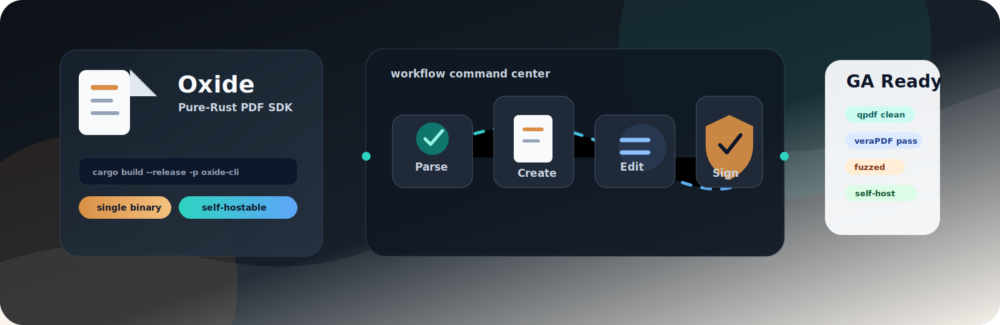

# Oxide

<p align="center">
  
</p>

**A Rust-native document parser.** Oxide turns PDFs into structured, AI/RAG-ready
output — **Markdown, JSON, semantic HTML, RAG chunks, and key-value fields** —
with **qpdf-class structural operations** (merge / split / extract-pages), an
**optional OCR** path for scanned pages, and a **pure-Rust core** with no Python,
no torch/ML stack, and no Poppler/Ghostscript. One canonical document model,
emitted identically across the CLI, the Rust library, a C ABI, WebAssembly, and a
self-hostable HTTP server.

> Docling-class structured extraction + qpdf-class structural ops, pure-Rust,
> fast, safe, embeddable, and self-hostable. See
> [`docs/parser_positioning.md`](docs/parser_positioning.md) for the honest
> where-it-leads / where-it-trails.

## Quick start

```sh
# Build the single-binary CLI (add --features ocr for scanned-page OCR):
cargo build --release -p oxide-cli

# Parse a PDF into clean Markdown / JSON for RAG and automation:
oxide parse input.pdf --format markdown
oxide parse input.pdf --format json

# RAG-ready semantic chunks, and structured key-value fields:
oxide chunk input.pdf --target-tokens 512
oxide extract-fields input.pdf --type invoice

# What did I build? (reports engine version + whether OCR is compiled in)
oxide --version
```

## Step-by-step setup

<details open>
<summary><strong>1. Install prerequisites</strong></summary>

- Rust stable toolchain with Cargo.
- `qpdf` for structural validation checks.
- Optional: Poppler and veraPDF for render/compliance validation.
- Optional OCR: Tesseract with language data when building with `--features ocr`.

```sh
rustup update stable
cargo --version
qpdf --version
```

</details>

<details>
<summary><strong>2. Build the CLI</strong></summary>

```sh
cargo build --release -p oxide-cli

# Windows
target\release\oxide.exe --version

# macOS/Linux
./target/release/oxide --version
```

For scanned-page OCR support:

```sh
cargo build --release -p oxide-cli --features ocr
```

</details>

<details>
<summary><strong>3. Parse, chunk, and extract fields</strong></summary>

```sh
oxide parse input.pdf --format markdown --output output.md
oxide parse input.pdf --format json --output output.json
oxide chunk input.pdf --target-tokens 512 --output chunks.json
oxide extract-fields input.pdf --type invoice --output fields.json
```

Use this path for RAG ingestion, document intelligence, and structured
automation over digital-born PDFs.

</details>

<details>
<summary><strong>4. Run structural and compliance workflows</strong></summary>

```sh
oxide optimize input.pdf -o optimized.pdf
oxide linearize input.pdf -o fast-web-view.pdf
oxide encrypt input.pdf -o encrypted.pdf --password change-me
```

For compliance and release validation, pair Oxide output with external checks:

```sh
qpdf --check fast-web-view.pdf
verapdf --format text compliant.pdf
```

</details>

<details>
<summary><strong>5. Embed Oxide in your product</strong></summary>

- Rust library: `oxide-engine`
- CLI automation: `oxide`
- C ABI: `oxide-capi`
- Browser/WASM: `oxide-wasm`
- Self-hosted API: `oxide-server`

Start with [`docs/api_overview.md`](docs/api_overview.md) for the Rust surface
and [`docs/self_hosting.md`](docs/self_hosting.md) for the HTTP server.

</details>

## Embedding

The same canonical extraction is available four ways — parse once, consume
anywhere:

- **Rust library** (`oxide-engine`): `use oxide_engine::prelude::*;` then
  `engine.parse_document(&ParseOptions::default())?.to_markdown_default()`. See
  `crates/engine/examples/parse_to_markdown.rs`.
- **C ABI** (`oxide-capi`): `oxide_document_parse_markdown` /
  `oxide_document_parse_json` / `oxide_document_extract_fields_json`. See
  [`docs/bindings.md`](docs/bindings.md).
- **WebAssembly** (`oxide-wasm`): in-browser `parseMarkdown()` / `parseJson()` /
  `chunk()` / `extractFieldsJson()` — digital-born only (no OCR in the browser).
- **HTTP server** (`oxide-server`): self-hostable `POST /api/v1/parse` /
  `/chunk` / `/extract-fields` / `/info`, with auth, rate limits, resource caps,
  and an async job queue. See [`docs/self_hosting.md`](docs/self_hosting.md).

## Self-hosting

Run the whole stack on your own machine or VPS — documents never leave your
hardware, no per-page cloud fees. See
[**`docs/self_hosting.md`**](docs/self_hosting.md) for the CLI, the server (with
and without OCR), Docker, browser-side WASM extraction, and resource/privacy
guidance.

## Documentation

| Doc | What it covers |
| --- | --- |
| [`docs/self_hosting.md`](docs/self_hosting.md) | Running Oxide yourself: CLI, server, OCR, Docker, WASM, config. |
| [`docs/oxide_sdk.md`](docs/oxide_sdk.md) | Capstone integration, fresh benchmarks, capability matrix, and release-readiness verdict. |
| [`docs/api_overview.md`](docs/api_overview.md) | Stable Rust/API entry points and capability map. |
| [`docs/stability.md`](docs/stability.md) | SemVer, MSRV, stable-vs-experimental policy, API drift checks. |
| [`docs/packaging.md`](docs/packaging.md) | Feature flags, publishing dry-runs, license audit, artifacts, release checklist. |
| [`docs/parser_positioning.md`](docs/parser_positioning.md) | Honest positioning vs Docling / PyMuPDF / qpdf — wins **and** trails. |
| [`docs/parser_benchmark.md`](docs/parser_benchmark.md) | The reproducible extraction-quality benchmark + numbers. |
| [`docs/linearization_qpdf_clean_ga1.md`](docs/linearization_qpdf_clean_ga1.md) | qpdf-clean linearization hint-table fix and fixture breadth. |
| [`docs/document_parsing.md`](docs/document_parsing.md) | The canonical `Document` model and the `parse` surface. |
| [`docs/compliance.md`](docs/compliance.md) | PDF/A-1b/2b/2a/3b/3a validation and bounded conversion, plus PDF/UA basic checks. |
| [`docs/bindings.md`](docs/bindings.md) | C ABI and WebAssembly embedding. |
| [`docs/security.md`](docs/security.md) | Server security posture + deploy checklist. |
| [`docs/security/posture.md`](docs/security/posture.md) | Consolidated hardening posture: fuzzing, differential checks, property tests, audit gates, and residual risk. |
| [`docs/jobs.md`](docs/jobs.md) | The async job API and its limitations. |
| [`CHANGELOG.md`](CHANGELOG.md) | Release notes and notable API changes. |
| [`.env.example`](.env.example) | The complete `OXIDE_*` server configuration reference. |

## What it's good at (and what it isn't)

**Leads:** startup/footprint (single ~12 MB binary, ~6 ms cold start; no Python
or torch), reading order on multi-column layouts, clean digital tables, key-value
extraction, OCR'd-text recovery where PyMuPDF/Poppler do nothing, embeddability
(Rust/C/WASM/HTTP), privacy/self-hosting, and memory safety.

**Trails:** OCR'd-table grid reconstruction, key-value recall on messy scans
(bounded by Tesseract), pixel-faithful rendering (use Poppler/PDFium — see
`docs/oxide_vs_poppler.md`), and the breadth of ML-model understanding on exotic
layouts (Docling head-to-head not measured locally). Structural write operations
are available for encrypt, rotate, optimize, repair, and qpdf-clean
linearization for the supported structural subset. New PDFs can be authored
from scratch with `PdfBuilder` and `FlowDocument` (pages, text, vector graphics,
images, whole TrueType font embedding, tables, and single-column flow layout;
see `docs/authoring.md`). Existing PDFs can be edited additively with
watermarks, headers/footers, overlays/underlays, image stamps, and append-only
incremental updates that preserve the original byte prefix, plus full-rewrite
redaction, annotation writes, and AcroForm fill/flatten (see `docs/editing.md`).
PDF/A-1b/2b/2a/3b/3a validation, bounded PDF/A conversion for embedded-font
documents, PDF/A-3 associated-file handling, and PDF/UA basic
validation/best-effort tagging are available through the compliance API (see
`docs/compliance.md`).
Decrypt-as-write, linearized object-stream packing, custom font subsetting,
CFF/OpenType embedding, and advanced multi-column layout remain documented
follow-ups.

All claims are reproducible via the benchmark in `extraction-benchmark/`.

## License

MIT OR Apache-2.0 — permissive, non-copyleft. See
[`LICENSE-MIT`](LICENSE-MIT), [`LICENSE-APACHE`](LICENSE-APACHE), and
[`docs/licenses.md`](docs/licenses.md) (includes bundled-font licensing).
